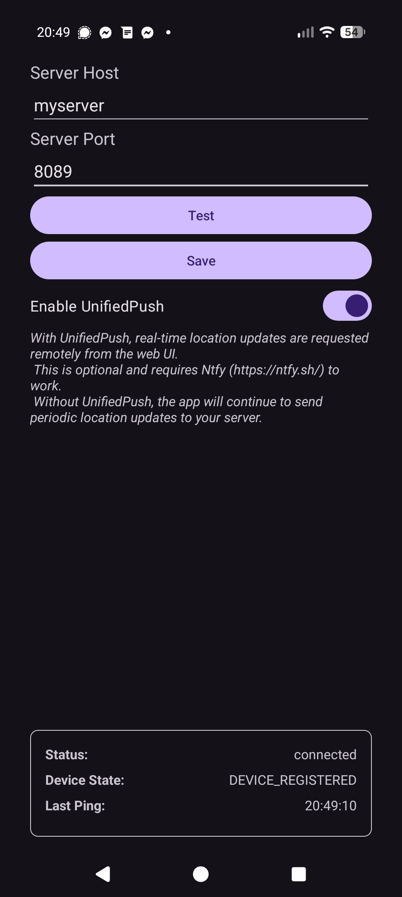

# LocationHistory

Build status:


> **Private, self-hosted, and secure location tracking.**

LocationHistory is an open-source alternative to Google's "Find Your Phone"
(and essentially also Google Timeline).
It allows you to track your device's location,
store the data on your own server,
and visualize your history without sharing your data with third parties.

Designed with privacy as the core feature,
LocationHistory ensures that your movement data remains yours.

|                                         |  |
|:---------------------------------------:| :---: |

## How To Use It

1. Get the Android app (currently local build, proper releases coming soon!)
2. Host your LocationHistory server via [Docker Compose](https://docs.docker.com/compose/) (see the [example docker-compose.yml](./examples) for more info)

## Security

Client communication uses auto-generated self-signed SSL certificates,
with a TOFU (trust-on-first-use) model.

⚠ **By default the admin endpoint is NOT using SSL, in order to
enable a user-friendly setup (i.e. avoiding self-signed certificate headaches).**

Therefore, unless you configure SSL for the UI,
logging into the backend should only be done on your local network
& not exposed externally (otherwise your admin password could be exposed)!

Optional SSL setup is coming soon.

---

## Project Structure

This repository is a monorepo containing all components:

| Component | Path                            | Description                                                                 |
| :--- |:--------------------------------|:----------------------------------------------------------------------------|
| **Server** | [`/server`](./server/README.md) | The gRPC backend that ingests and stores location data, also serving the UI |
| **Client** | [`/client`](./client/README.md)           | Native Android application for battery-friendly background location syncing |
| **UI** | [`/ui`](./ui/README.md)                   | Modern TypeScript-based web dashboard for visualizing history.              |
| **Shared** | [`/shared`](./shared/README.md)           | Shared protocol definitions and logic.                                      |

## Getting Started

### Prerequisites
- **Java 17+** (Required for Server & Android builds)
- **Node.js 18+** & **npm** (Required for UI)
- **sbt** (Scala Build Tool)
- **Docker** (For packaging and running locally)

### Build & Run
We use a root `Makefile` to orchestrate builds across the entire stack.

```bash
# Build & package all components
make package-local

# Run everything locally
make run
```

For more details on building & running individual components,
refer to individual components' READMEs.

## License
This project is licensed under the [GPLv3 License](https://www.gnu.org/licenses/gpl-3.0.en.html).